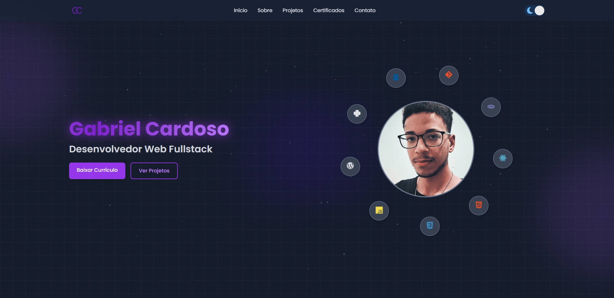

---

<h1 align="center">Portfólio</h1>

---

<h2 align="center">📖Sobre</h2>

Este portfólio foi desenvolvido do zero utilizando React.js, com foco em responsividade, performance e experiência do usuário. Ele reúne meus principais projetos, todos funcionais e conectados aos seus repositórios e domínios, além de uma seção com certificados que comprovam minha trajetória de aprendizado e uma área de contato direto.
  
O layout foi pensado para ser limpo e intuitivo, com componentes reutilizáveis, navegação fluida e design responsivo, garantindo uma boa visualização em qualquer dispositivo. Este projeto representa minha dedicação em evoluir como desenvolvedor front-end e criar soluções modernas com qualidade e atenção aos detalhes.

---

<h2 align="center">✔O site contém:</h2>

✅ Responsivo 
✅ Dark/Light mode 
✅ Botão de download 
✅ Animações 
✅ Back to top 
✅ Slides 
✅ Barra de progresso 
✅ Seção de contato 
✅ Links para projetos 

### etc...

---

<h2 align="center">🖥Preview</h2>

</img>
 
 
<h2 align="center">📱Preview</h2>
 
 
</img>

### Veja o projeto em funcionamento <a href="https://portfolio--gabriel.vercel.app/">aqui</a>. 🧐

---

<h2 align="center">🛠 Tecnologias</h2>

- [React JS](https://react.dev/)
- [CSS](https://developer.mozilla.org/pt-BR/docs/Web/CSS)
- [JavaScript](https://www.javascript.com/)
- [TailWind CSS](https://tailwindcss.com/)

---

<h2 align="center">📝Licença</h2>

   Este repositório está sob licença MIT. Você pode ver o arquivo <a href="https://github.com/gabriell-c/portfolio_2.0/blob/main/LICENSE"> LICENSE</a> para mais detalhes. 😉

